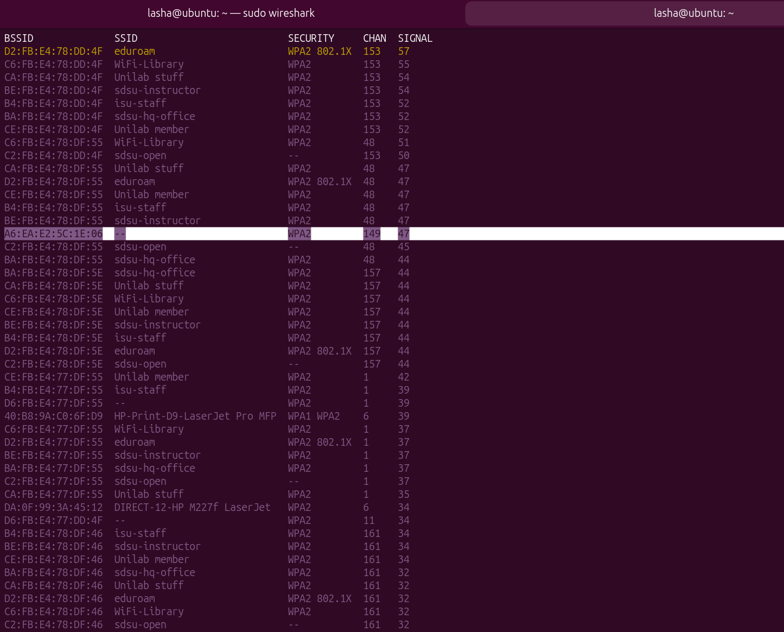
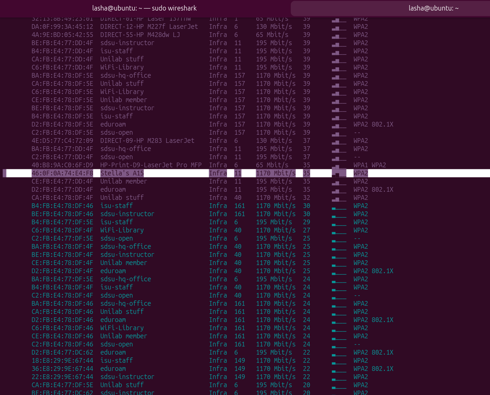
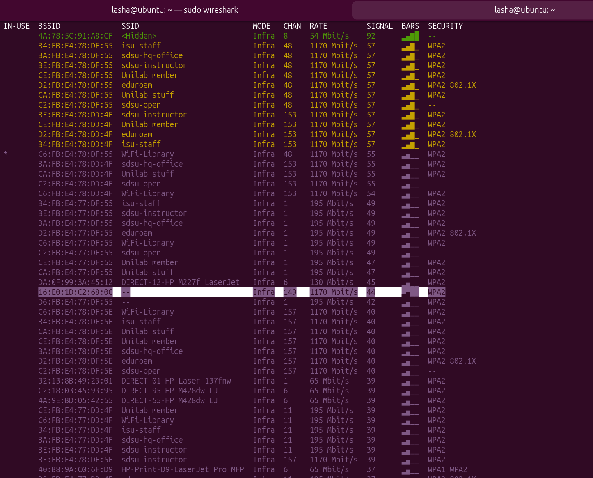

# Closest thing i found when MAC adress randomizer was on

used `sudo nmcli dev wifi list` and found 2 devices with hidden SSIDs
```
D6:FB:E4:77:DF:55  --                            Infra  1     195 Mbit/s   42      ▂▄__  WPA2
A6:EA:E2:5C:1E:06 --                            Infra  149   1170 Mbit/s  50      ▂▄__  WPA2
```



then i found a samsung device named Stella's A15 which after checking was not the correct device

```
46:0F:0A:74:E4:F8  Stella's A15                  Infra  11    1170 Mbit/s  35      ▂▄__  WPA2        
```



# MAC randomizer off

after it was turned off the A6: device changed to 16: which removed the D6: from possible devices

```
16:E0:1D:C2:68:0C  --                            Infra  149   1170 Mbit/s  44      ▂▄__  WPA2
```



# Answer

Randomized MAC: A6:EA:E2:5C:1E:06

Primary MAC: 16:E0:1D:C2:68:0C (5 GHz, Channel 149)

SSID: Patriki

passowrd: idk
